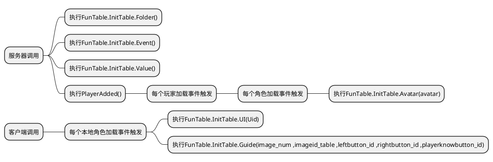

> 新手引导系统:   	

> [!note|label:逻辑图]



> [!note]*AvatarAdded()中的代码会在每个客户端加载完成的时候执行一次*
- 放在**角色加载完成事件**中(客户端脚本):


```lua

local FunTable=RWrequire(CommonStorage["FunTable"]) -- 函数表

--————————————————————游戏初始化————————————————————--
local function AvatarAdded()
	local bool = true
	Players.PlayerAdded:Connect(function(Uid)
			if bool == true then -- 等待玩家加载完成
				bool = false
				local player=Players:GetPlayerByUserId(Uid)
				player.AvatarAdded:Connect(function(avatar)
						FunTable.InitTable.UI(Uid) --调用初始化UI界面函数

						-- 此处添加角色加载完成后执行客户端的代码
						-- 此处修改图片ID
						-- image_num 引导图片数量 ;imageid_table 引导图片ID表(类型:table) ;leftbutton_id 左边按钮图片ID ;rightbutton_id 右边按钮图片ID ;playerknowbutton_id 我知道了按钮ID
						local image_num=3
						local imageid_table={"rwid://T78iPKNiAR0.9okijN",
							"rwid://T7k.PKAirR0.9okijN",
							"rwid://T7dKPKZxkR0.9okijN"}
						local leftbutton_id="rwid://T7kKPKA0hR0.9okijN"
						local rightbutton_id="rwid://T7xdPKZFiR0.9okijN"
						local playerknowbutton_id="rwid://T7k.PKVMkR0.9okijN"
						FunTable.InitTable.Guide(image_num ,imageid_table ,leftbutton_id ,rightbutton_id ,playerknowbutton_id) -- 调用新手引导系统

					end)
			end
		end)
end
AvatarAdded()
--————————————————————————————————————————ClientExpression————————————————————————————————————————--
-- 此处编写客户端表现

--————————————————————————————————————————ClientLogic————————————————————————————————————————--
-- 此处编写客户端逻辑代码

```


> [!note|label:视图]

　　　　　　层级:   	
　　　　　　
  
  
　　　　　　示例:  	
　　　　　　


> [!note]*不需要添加除框架以外的代码*
- (服务器脚本)

```lua

local FunTable=RWrequire(CommonStorage["FunTable"]) -- 函数表


local FunTable=RWrequire(CommonStorage["FunTable"]) -- 函数表

--————————————————————游戏初始化————————————————————--
-- 初始化文件层级
FunTable.InitTable.Folder()

-- 初始化事件对象
FunTable.InitTable.Event()

-- 初始化数值
FunTable.InitTable.Value()

local function PlayerAdded()
    Players.PlayerAdded:Connect(function(Uid)
            local player=Players:GetPlayerByUserId(Uid)
            player.AvatarAdded:Connect(function(avatar) -- 为每个玩家的角色注册角色加载完成触发事件
                    FunTable.InitTable.Avatar(avatar) -- 初始化角色数据
                end)

            -- 此处添加玩家加载完成后执行的服务器代码
            
        end)
end
PlayerAdded()
--————————————————————————————————————————ServerExpression————————————————————————————————————————--
-- 此处编写服务器表现

--————————————————————————————————————————ServerLogic————————————————————————————————————————--
-- 此处编写服务器逻辑

```

> [!note|label:视图]

　　　　　　层级:  	
　　　　　　
  
  
　　　　　　效果:  	
　　　　　　


> [!note]*函数调用放在**SysCallTable**的**CommonStorage**中 ; 函数实现放在**SysCallTable**的**Client**中*
- (通用模块脚本)

```lua

-- InitTable 初始化函数表 ; MyCallTable 用户自定义调用函数表 ; SysCallTable 系统定义调用函数表
local FunTable={ InitTable = {}, MyCallTable = {}, SysCallTable = {}} -- 函数表
-- 随机种子
math.randomseed(tostring(os.time()):reverse():sub(1, 7))
--——————————————————————————————————————InitTable = {}——————————————————————————————————————--
--——————————————————————————CommonStorage——————————————————————————--
--——————————初始化事件对象——————————--
function FunTable.InitTable.Event()
	if CommonStorage["EventFolder"].ServerFireClient == nil then
		--创建子集事件对象ServerFireClient
		local event1=RWObject:New("EventObject")
		event1.Name="ServerFireClient"
		event1.Parent=CommonStorage["EventFolder"]
		--创建子集事件对象ClientFireServer
		local event2=RWObject:New("EventObject")
		event2.Name="ClientFireServer"
		event2.Parent=CommonStorage["EventFolder"]
		--创建子集事件对象ServerFireServer
		local event3=RWObject:New("EventObject")
		event3.Name="ServerFireServer"
		event3.Parent=CommonStorage["EventFolder"]
		--创建子集事件对象ClientFireClient
		local event4=RWObject:New("EventObject")
		event4.Name="ClientFireClient"
		event4.Parent=CommonStorage["EventFolder"]
	end
end

--——————————通用存储层级文件初始化——————————--
function FunTable.InitTable.Folder()
	if CommonStorage.EventFolder == nil then
		--创建父级文件夹EventFolder
		local folder1=RWObject:New("Folder")
		folder1.Name="EventFolder"
		folder1.Parent=CommonStorage
		--创建父级文件夹ValueFolder
		local folder2=RWObject:New("Folder")
		folder2.Name="ValueFolder"
		folder2.Parent=CommonStorage
		--创建子集文件夹IntFolder
		local IntFolder=RWObject:New("Folder")
		IntFolder.Parent=CommonStorage["ValueFolder"]
		IntFolder.Name="IntFolder"
		--创建子集文件夹NumFolder
		local NumFolder=RWObject:New("Folder")
		NumFolder.Parent=CommonStorage["ValueFolder"]
		NumFolder.Name="NumFolder"
		--创建子集文件夹VectorFolder
		local VectorFolder=RWObject:New("Folder")
		VectorFolder.Parent=CommonStorage["ValueFolder"]
		VectorFolder.Name="VectorFolder"
		--创建子集文件夹ColorFolder
		local ColorFolder=RWObject:New("Folder")
		ColorFolder.Parent=CommonStorage["ValueFolder"]
		ColorFolder.Name="ColorFolder"
		--创建子集文件夹RayFolder
		local RayFolder=RWObject:New("Folder")
		RayFolder.Parent=CommonStorage["ValueFolder"]
		RayFolder.Name="RayFolder"
		--创建子集文件夹ObjFolder
		local ObjFolder=RWObject:New("Folder")
		ObjFolder.Parent=CommonStorage["ValueFolder"]
		ObjFolder.Name="ObjFolder"
		--创建父级文件夹MapFolder
		local folder3=RWObject:New("Folder")
		folder3.Name="MapFolder"
		folder3.Parent=ServerStorage
		--创建父级文件夹ShopFolder
		local folder4=RWObject:New("Folder")
		folder3.Name="ShopFolder"
		folder3.Parent=CommonStorage
	end
end

--——————————数值初始化——————————--
function FunTable.InitTable.Value()
	if CommonStorage["ValueFolder"]["NumFolder"].AvatarMoveSpeed == nil then
		--角色移动速度
		local AvatarMoveSpeed=RWObject:New("NumberValue")
		AvatarMoveSpeed.Name="AvatarMoveSpeed"
		AvatarMoveSpeed.Parent=CommonStorage["ValueFolder"]["NumFolder"]
		AvatarMoveSpeed.Value=4
		--角色跳跃初速度
		local AvatarJumpSpeed=RWObject:New("NumberValue")
		AvatarJumpSpeed.Name="AvatarJumpSpeed"
		AvatarJumpSpeed.Parent=CommonStorage["ValueFolder"]["NumFolder"]
		AvatarJumpSpeed.Value=12
		--角色信息显示距离
		local AvatarDisPlayDistance=RWObject:New("NumberValue")
		AvatarDisPlayDistance.Name="AvatarDisPlayDistance"
		AvatarDisPlayDistance.Parent=CommonStorage["ValueFolder"]["NumFolder"]
		AvatarDisPlayDistance.Value=15
		--摄像机距离
		local CameraDistance=RWObject:New("NumberValue")
		CameraDistance.Name="CameraDistance"
		CameraDistance.Parent=CommonStorage["ValueFolder"]["NumFolder"]
		CameraDistance.Value=2.5
		--摄像机距离上限
		local CameraMaxZoomDistance=RWObject:New("NumberValue")
		CameraMaxZoomDistance.Name="CameraMaxZoomDistance"
		CameraMaxZoomDistance.Parent=CommonStorage["ValueFolder"]["NumFolder"]
		CameraMaxZoomDistance.Value=5
		--摄像机距离下限
		local CameraMinZoomDistance=RWObject:New("NumberValue")
		CameraMinZoomDistance.Name="CameraMinZoomDistance"
		CameraMinZoomDistance.Parent=CommonStorage["ValueFolder"]["NumFolder"]
		CameraMinZoomDistance.Value=0
		--摄像机远景视野范围
		local CameraFarClipPlane=RWObject:New("NumberValue")
		CameraFarClipPlane.Name="CameraFarClipPlane"
		CameraFarClipPlane.Parent=CommonStorage["ValueFolder"]["NumFolder"]
		CameraFarClipPlane.Value=256
		--环境日光颜色
		local EnvironmentLightColor=RWObject:New("Vector3Value")
		EnvironmentLightColor.Name="EnvironmentLightColor"
		EnvironmentLightColor.Parent=CommonStorage["ValueFolder"]["VectorFolder"]
		EnvironmentLightColor.Value=Vector3(250,250,230)
		--环境日光方向
		local EnvironmentWorldRotation=RWObject:New("Vector3Value")
		EnvironmentWorldRotation.Name="EnvironmentWorldRotation"
		EnvironmentWorldRotation.Parent=CommonStorage["ValueFolder"]["VectorFolder"]
		EnvironmentWorldRotation.Value=Vector3(0,0,0)
	end
end
--——————————————————————————CommonStorage——————————————————————————--

--——————————————————————————Server——————————————————————————--
--——————————角色数据初始化——————————--
function FunTable.InitTable.Avatar(avatar)
	--移动速度初始化
	avatar.MoveSpeed=CommonStorage["ValueFolder"]["NumFolder"]["AvatarMoveSpeed"].Value
	--跳跃速度初始化
	avatar.JumpSpeed=CommonStorage["ValueFolder"]["NumFolder"]["AvatarJumpSpeed"].Value
	--信息显示距离初始化
	avatar.DisplayDistance=CommonStorage["ValueFolder"]["NumFolder"]["AvatarDisPlayDistance"].Value
end
--——————————————————————————Server——————————————————————————--

--——————————————————————————Client——————————————————————————--
--——————————UI界面数据初始化——————————--
function FunTable.InitTable.UI(Uid)
	local player=Players:GetPlayerByUserId(Uid)
	if player["GameUI"].GamePrepareUI == nil then
		local GamePrepareUI=RWObject:New("UiPanel")
		GamePrepareUI.Name="GamePrepareUI"
		GamePrepareUI.Parent=player["GameUI"]
		GamePrepareUI.AnchorMin=Vector2(0.5,0.5)
		GamePrepareUI.AnchorMax=Vector2(0.5,0.5)
		GamePrepareUI.SizeDelta=Vector2(-8,-6)
		GamePrepareUI.ImageColorA=0
		GamePrepareUI.IgnoreRayCast=true
	end
end

--——————————摄像机数据初始化——————————--
function FunTable.InitTable.Camera()
	local Camera=GetService("WorkSpace").CurCamera --获取当前摄像机
	Camera.CameraType=Enum.CameraType.Follow --摄像机类型:默认跟随
	Camera.Subject=Players:GetLocalPlayer().Avatar --摄像机对象
	Camera.Distance=CommonStorage["ValueFolder"]["NumFolder"]["CameraDistance"].Value
	Camera.MaxZoomDistance=CommonStorage["ValueFolder"]["NumFolder"]["CameraMaxZoomDistance"].Value
	Camera.MinZoomDistance=CommonStorage["ValueFolder"]["NumFolder"]["CameraMinZoomDistance"].Value
	Camera.FarClipPlane=CommonStorage["ValueFolder"]["NumFolder"]["CameraFarClipPlane"].Value
end

--——————————环境数据初始化——————————--
function FunTable.InitTable.Environment()
	local Environment=WorkSpace["Environment"]
	Environment.LightColor=CommonStorage["ValueFolder"]["VectorFolder"]["EnvironmentLightColor"].Value
	Environment.WorldRotation=CommonStorage["ValueFolder"]["VectorFolder"]["EnvironmentLightColor"].Value
end
--——————————————————————————Client——————————————————————————--
--——————————————————————————————————————InitTable = {}——————————————————————————————————————--


--——————————————————————————————————————SysCallTable = {}——————————————————————————————————————--
--——————————————————————————CommonStorage——————————————————————————--
-- 此处编写通用存储模块代码
--——————————新手引导初始化——————————--
function FunTable.InitTable.Guide(image_num ,imageid_table ,leftbutton_id ,rightbutton_id ,playerknowbutton_id)
	if Players:GetLocalPlayer()["GameUI"].guideParentPanel == nil then
		BeginnerGuidance(image_num ,imageid_table ,leftbutton_id ,rightbutton_id ,playerknowbutton_id) -- 调用新手引导系统
	end
end
--——————————————————————————CommonStorage——————————————————————————--

--——————————————————————————Server——————————————————————————--
-- 此处编写服务器代码

--——————————————————————————Server——————————————————————————--

--——————————————————————————Client——————————————————————————--
-- 此处编写客户端代码
--——————————新手引导函数——————————--
-- 创建新手引导界面函数
local function EstablishGuideUI(image_num,imageid_table,leftbutton_id,rightbutton_id,playerknowbutton_id)
	local guideParentPanel=RWObject:New("UiPanel") -- 创建父级容器
	guideParentPanel.SizeDelta=Vector2(1900,1080) -- 设置大小
	guideParentPanel.ImageColor=Vector3(0,0,0) -- 颜色:黑色
	guideParentPanel.ImageColorA=0.35 -- 透明度
	guideParentPanel.IgnoreRayCast=false -- 穿透:否
	guideParentPanel.Name="guideParentPanel"
	guideParentPanel.Parent=Players:GetLocalPlayer()["GameUI"]
	local guideIndex=RWObject:New("IntValue")
	guideIndex.Name="guideIndex"
	guideIndex.Parent=CommonStorage["ValueFolder"]["IntFolder"] -- 设置父级
	guideIndex.Value=1 -- 初始化索引为1
	for i=1,image_num,1 do
		local guideImage=RWObject:New("UiImage")
		guideImage.AnchoredPosition=Vector2(0,90) -- 设置相对锚点的坐标
		guideImage.SizeDelta=Vector2(1000,650) -- 设置大小
		guideImage.IgnoreRayCast=true -- 穿透:是
		guideImage.IsVisible=false -- 默认关闭
		guideImage.SourceImage=imageid_table[i]
		guideImage.Parent=guideParentPanel
	end
	local guideButtonLeft=RWObject:New("UiButton") -- 创建左按钮
	guideButtonLeft.Name="guideButtonLeft"
	guideButtonLeft.Parent=Players:GetLocalPlayer()["GameUI"]["guideParentPanel"] -- 设置父级
	guideButtonLeft.SizeDelta=Vector2(200,150) -- 设置大小
	guideButtonLeft.AnchoredPosition=Vector2(-500,90) -- 设置相对锚点的位置
	guideButtonLeft.SourceImage=leftbutton_id
	guideButtonLeft.DisabledColor=Vector3(145,145,145) -- 设置禁用颜色
	guideButtonLeft.Interactable=false -- 初始化为禁用
	local guideButtonRight=RWObject:New("UiButton") -- 创建右按钮
	guideButtonRight.Name="guideButtonRight"
	guideButtonRight.Parent=Players:GetLocalPlayer()["GameUI"]["guideParentPanel"] -- 设置父级
	guideButtonRight.SizeDelta=Vector2(200,150) -- 设置大小
	guideButtonRight.AnchoredPosition=Vector2(500,90) -- 设置相对锚点的位置
	guideButtonRight.SourceImage=rightbutton_id
	guideButtonRight.DisabledColor=Vector3(145,145,145) -- 设置禁用颜色
	local playerKnow=RWObject:New("UiButton") -- 创建我知道了按钮
	playerKnow.Name="playerKnow"
	playerKnow.Parent=Players:GetLocalPlayer()["GameUI"]["guideParentPanel"] -- 设置父级
	playerKnow.IsVisible=false -- 默认关闭
	playerKnow.AnchoredPosition=Vector2(0,-250) -- 设置相对锚点的位置
	playerKnow.SizeDelta=Vector2(300,170) -- 设置大小
	playerKnow.SourceImage=playerknowbutton_id
end
-- 角色移动速度修改
local function AvatarStopMove(agrs_move)
	local avatar = Players:GetLocalPlayer().Avatar
	if agrs_move == "stop" then
		avatar.MoveSpeed = 0
	elseif agrs_move == "move" then
		avatar.MoveSpeed = CommonStorage["ValueFolder"]["NumFolder"]["AvatarMoveSpeed"].Value
	end
end
-- 知道了点击函数
local function PlayerKnow()
	local player=Players:GetLocalPlayer() -- 玩家
	local playerKnow=player["GameUI"]["guideParentPanel"]["playerKnow"]
	playerKnow.IsVisible=true -- 打开我知道了按钮
	playerKnow.OnClick:Connect(function()
			player["GameUI"]["guideParentPanel"].IgnoreRayCast = true --打开穿透
			player["GameUI"]["guideParentPanel"].IsVisible=false -- 关闭新手引导界面
			AvatarStopMove("move") -- 调用修改角色移动速度函数(恢复玩家速度)
		end)
end
-- 左按钮点击函数
local function LeftButtonOnclick(guideImageTable)
	local player=Players:GetLocalPlayer() -- 玩家
	local leftButton=player["GameUI"]["guideParentPanel"]["guideButtonLeft"]
	local index=CommonStorage["ValueFolder"]["IntFolder"]["guideIndex"]
	leftButton.OnClick:Connect(function()
			if index.Value>1 then
				local rightButton=player["GameUI"]["guideParentPanel"]["guideButtonRight"]
				rightButton.Interactable=true -- 启用右按钮
				guideImageTable[index.Value].IsVisible=false
				index.Value=index.Value-1
				guideImageTable[index.Value].IsVisible=true
				if index.Value==1 then
					leftButton.Interactable=false -- 禁用左按钮
				end
			end
		end)
end
-- 右按钮点击函数
local function RightButtonOnclick(guideImageTable)
	local player=Players:GetLocalPlayer() -- 玩家
	local rightButton=player["GameUI"]["guideParentPanel"]["guideButtonRight"]
	local index=CommonStorage["ValueFolder"]["IntFolder"]["guideIndex"]
	rightButton.OnClick:Connect(function()
			if index.Value<3 then
				local leftButton=player["GameUI"]["guideParentPanel"]["guideButtonLeft"]
				leftButton.Interactable=true -- 启用左按钮
				guideImageTable[index.Value].IsVisible=false
				index.Value=index.Value+1
				guideImageTable[index.Value].IsVisible=true
				if index.Value==3 then -- 到最右边
					rightButton.Interactable=false -- 禁用右按钮
					PlayerKnow() -- 调用我知道了点击函数
				end
			end
		end)
end
-- image_num 引导图片数量 ;imageid_table 引导图片ID表(类型:table) ;leftbutton_id 左边按钮图片ID ;rightbutton_id 右边按钮图片ID ;playerknowbutton_id 我知道了按钮ID
function BeginnerGuidance(image_num ,imageid_table ,leftbutton_id ,rightbutton_id ,playerknowbutton_id)
	if #imageid_table==image_num then -- 传入图片数量和id数一样
		EstablishGuideUI(image_num ,imageid_table ,leftbutton_id ,rightbutton_id ,playerknowbutton_id) -- 调用创建新手引导界面函数
		AvatarStopMove("stop") -- 调用修改角色移动速度函数(角色禁止移动)
		local guideTable=Players:GetLocalPlayer()["GameUI"]["guideParentPanel"]:GetAllChild()
		local guideImageTable={} -- 引导图片表
		for k , v in ipairs(guideTable) do
			if v:IsClass("UiImage") then
				guideImageTable[k]=v
			end
		end
		guideImageTable[1].IsVisible=true -- 默认打开第一个引导图片
		LeftButtonOnclick(guideImageTable) -- 调用左按钮点击函数
		RightButtonOnclick(guideImageTable) -- 调用右按钮点击函数
	end
end
--——————————新手引导函数——————————--
--——————————————————————————Client——————————————————————————--
--——————————————————————————————————————SysCallTable = {}——————————————————————————————————————--


--——————————————————————————————————————MyCallTable = {}——————————————————————————————————————--
--——————————————————————————CommonStorage——————————————————————————--
-- 此处添加你的通用模块代码

--——————————————————————————CommonStorage——————————————————————————--

--——————————————————————————Server——————————————————————————--
-- 此处添加你的服务器代码

--——————————————————————————Server——————————————————————————--

--——————————————————————————Client——————————————————————————--
-- 此处添加你的客户端代码

--——————————————————————————Client——————————————————————————--
--——————————————————————————————————————MyCallTable = {}——————————————————————————————————————--

return FunTable

```


> [!note|label:视图]

　　　　　　层级:   	
　　　　　　


　　　　　　示例:  
　　　　　　*注: 代码已折叠*  
　　　　　　

> [!note|label:效果]

　　　　　　效果一:　　　　　　　　　　效果二:　　　　　　　　　　　　效果三:   	
　　　　　　　　　　　　　　　　　　　　　　　　　　　　　

  　　　　　　示例:  
　　　　　　