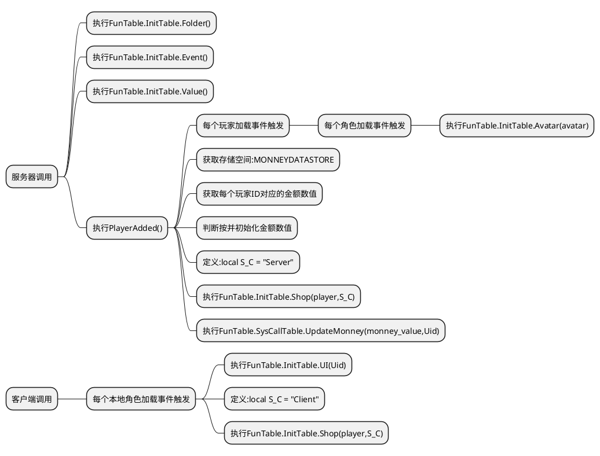

> 商城系统

> [!note|label:逻辑图]


> [!note] *角色加载完成后__FunTable.InitTable.Shop(player,S_C)__都会执行一次*
- (客户端脚本)

```lua

local FunTable=RWrequire(CommonStorage["FunTable"]) -- 函数表

--————————————————————游戏初始化————————————————————--
local function AvatarAdded()
	local bool = true
	Players.PlayerAdded:Connect(function(Uid)
			if bool == true then -- 等待玩家加载完成
				bool = false
				local player=Players:GetPlayerByUserId(Uid)
				player.AvatarAdded:Connect(function(avatar)
						FunTable.InitTable.UI(Uid) --初始化UI界面

						-- 此处添加角色加载完成后执行客户端的代码
						local S_C = "Client"
						FunTable.InitTable.Shop(player,S_C) -- 调用商店系统(客户端)
					end)
			end
		end)
end
AvatarAdded()
--————————————————————————————————————————ClientExpression————————————————————————————————————————--
-- 此处编写客户端表现

--————————————————————————————————————————ClientLogic————————————————————————————————————————--
-- 此处编写客户端逻辑

```

> [!note|label:视图]


　　　　　　层级:   	
　　　　　　
  
  
　　　　　　示例:  	
　　　　　　


> [!note]*对于**FunTable.SysCallTable.UpdateMonney****(monney_value,Uid)**函数,该函数用于提供给使用者更新商城的金额数据;  
在金额有变动时,需要调用该函数进行更新显示,值得注意的是,该函数传入的参数是更新后的金额,既先获取原有金额进行计算后在传入计算后的金额 .*
- (服务器脚本)


```lua

local FunTable=RWrequire(CommonStorage["FunTable"]) -- 函数表

--————————————————————游戏初始化————————————————————--
-- 初始化文件层级
FunTable.InitTable.Folder()

-- 初始化事件对象
FunTable.InitTable.Event()

-- 初始化数值
FunTable.InitTable.Value()

-- 初始化角色数据
local function PlayerAdded()
	Players.PlayerAdded:Connect(function(Uid)
			local player=Players:GetPlayerByUserId(Uid)
			player.AvatarAdded:Connect(function(avatar)
					FunTable.InitTable.Avatar(avatar) -- 初始化角色数据
				end)

			local monneyDataStore = GetService("DataStoreService"):FindDataStore("MONNEYDATASTORE") -- 获取MONNEYDATASTORE存储空间
			local monney_value , b = monneyDataStore:Get(Uid)
			if monney_value == nil then
				monney_value = 0
			end
--			monney_value = 1000 -- 测试用值
			local S_C = "Server"
			FunTable.InitTable.Shop(player,S_C) -- 调用商店系统(服务器)
			FunTable.SysCallTable.UpdateMonney(monney_value,Uid) -- 调用更新金额函数
		end)
end
PlayerAdded()
--————————————————————————————————————————ServerExpression————————————————————————————————————————--
-- 此处编写服务器表现

--————————————————————————————————————————ServerLogic————————————————————————————————————————--
-- 此处编写服务器逻辑


```


> [!note|label:视图]


　　　　　　层级:   	
　　　　　　
  
  
　　　　　　示例:  	
　　　　　　


> [!note]
- (通用模块脚本)


```lua


-- InitTable 初始化函数表 ; MyCallTable 用户自定义调用函数表 ; SysCallTable 系统定义调用函数表
local FunTable={ InitTable = {}, MyCallTable = {}, SysCallTable = {}} -- 函数表
-- 随机种子
math.randomseed(tostring(os.time()):reverse():sub(1, 7))
--——————————————————————————————————————InitTable = {}——————————————————————————————————————--
--——————————————————————————CommonStorage——————————————————————————--
--——————————初始化事件对象——————————--
function FunTable.InitTable.Event()
    if CommonStorage["EventFolder"].ServerFireClient == nil then
        --创建子集事件对象ServerFireClient
        local event1=RWObject:New("EventObject")
        event1.Name="ServerFireClient"
        event1.Parent=CommonStorage["EventFolder"]
        --创建子集事件对象ClientFireServer
        local event2=RWObject:New("EventObject")
        event2.Name="ClientFireServer"
        event2.Parent=CommonStorage["EventFolder"]
        --创建子集事件对象ServerFireServer
        local event3=RWObject:New("EventObject")
        event3.Name="ServerFireServer"
        event3.Parent=CommonStorage["EventFolder"]
        --创建子集事件对象ClientFireClient
        local event4=RWObject:New("EventObject")
        event4.Name="ClientFireClient"
        event4.Parent=CommonStorage["EventFolder"]
    end
end

--——————————通用存储层级文件初始化——————————--
function FunTable.InitTable.Folder()
    if CommonStorage.EventFolder == nil then
        --创建父级文件夹EventFolder
        local folder1=RWObject:New("Folder")
        folder1.Name="EventFolder"
        folder1.Parent=CommonStorage
        --创建父级文件夹ValueFolder
        local folder2=RWObject:New("Folder")
        folder2.Name="ValueFolder"
        folder2.Parent=CommonStorage
        --创建子集文件夹IntFolder
        local IntFolder=RWObject:New("Folder")
        IntFolder.Parent=CommonStorage["ValueFolder"]
        IntFolder.Name="IntFolder"
        --创建子集文件夹NumFolder
        local NumFolder=RWObject:New("Folder")
        NumFolder.Parent=CommonStorage["ValueFolder"]
        NumFolder.Name="NumFolder"
        --创建子集文件夹VectorFolder
        local VectorFolder=RWObject:New("Folder")
        VectorFolder.Parent=CommonStorage["ValueFolder"]
        VectorFolder.Name="VectorFolder"
        --创建子集文件夹ColorFolder
        local ColorFolder=RWObject:New("Folder")
        ColorFolder.Parent=CommonStorage["ValueFolder"]
        ColorFolder.Name="ColorFolder"
        --创建子集文件夹RayFolder
        local RayFolder=RWObject:New("Folder")
        RayFolder.Parent=CommonStorage["ValueFolder"]
        RayFolder.Name="RayFolder"
        --创建子集文件夹ObjFolder
        local ObjFolder=RWObject:New("Folder")
        ObjFolder.Parent=CommonStorage["ValueFolder"]
        ObjFolder.Name="ObjFolder"
        --创建父级文件夹MapFolder
        local folder3=RWObject:New("Folder")
        folder3.Name="MapFolder"
        folder3.Parent=ServerStorage
        --创建父级文件夹ShopFolder
        local folder4=RWObject:New("Folder")
        folder3.Name="ShopFolder"
        folder3.Parent=CommonStorage
    end
end

--——————————数值初始化——————————--
function FunTable.InitTable.Value()
    if CommonStorage["ValueFolder"]["NumFolder"].AvatarMoveSpeed == nil then
        --角色移动速度
        local AvatarMoveSpeed=RWObject:New("NumberValue")
        AvatarMoveSpeed.Name="AvatarMoveSpeed"
        AvatarMoveSpeed.Parent=CommonStorage["ValueFolder"]["NumFolder"]
        AvatarMoveSpeed.Value=4
        --角色跳跃初速度
        local AvatarJumpSpeed=RWObject:New("NumberValue")
        AvatarJumpSpeed.Name="AvatarJumpSpeed"
        AvatarJumpSpeed.Parent=CommonStorage["ValueFolder"]["NumFolder"]
        AvatarJumpSpeed.Value=12
        --角色信息显示距离
        local AvatarDisPlayDistance=RWObject:New("NumberValue")
        AvatarDisPlayDistance.Name="AvatarDisPlayDistance"
        AvatarDisPlayDistance.Parent=CommonStorage["ValueFolder"]["NumFolder"]
        AvatarDisPlayDistance.Value=15
        --摄像机距离
        local CameraDistance=RWObject:New("NumberValue")
        CameraDistance.Name="CameraDistance"
        CameraDistance.Parent=CommonStorage["ValueFolder"]["NumFolder"]
        CameraDistance.Value=2.5
        --摄像机距离上限
        local CameraMaxZoomDistance=RWObject:New("NumberValue")
        CameraMaxZoomDistance.Name="CameraMaxZoomDistance"
        CameraMaxZoomDistance.Parent=CommonStorage["ValueFolder"]["NumFolder"]
        CameraMaxZoomDistance.Value=5
        --摄像机距离下限
        local CameraMinZoomDistance=RWObject:New("NumberValue")
        CameraMinZoomDistance.Name="CameraMinZoomDistance"
        CameraMinZoomDistance.Parent=CommonStorage["ValueFolder"]["NumFolder"]
        CameraMinZoomDistance.Value=0
        --摄像机远景视野范围
        local CameraFarClipPlane=RWObject:New("NumberValue")
        CameraFarClipPlane.Name="CameraFarClipPlane"
        CameraFarClipPlane.Parent=CommonStorage["ValueFolder"]["NumFolder"]
        CameraFarClipPlane.Value=256
        --环境日光颜色
        local EnvironmentLightColor=RWObject:New("Vector3Value")
        EnvironmentLightColor.Name="EnvironmentLightColor"
        EnvironmentLightColor.Parent=CommonStorage["ValueFolder"]["VectorFolder"]
        EnvironmentLightColor.Value=Vector3(250,250,230)
        --环境日光方向
        local EnvironmentWorldRotation=RWObject:New("Vector3Value")
        EnvironmentWorldRotation.Name="EnvironmentWorldRotation"
        EnvironmentWorldRotation.Parent=CommonStorage["ValueFolder"]["VectorFolder"]
        EnvironmentWorldRotation.Value=Vector3(0,0,0)
    end
end
--——————————————————————————CommonStorage——————————————————————————--

--——————————————————————————Server——————————————————————————--
--——————————角色数据初始化——————————--
function FunTable.InitTable.Avatar(avatar)
    --移动速度初始化
    avatar.MoveSpeed=CommonStorage["ValueFolder"]["NumFolder"]["AvatarMoveSpeed"].Value
    --跳跃速度初始化
    avatar.JumpSpeed=CommonStorage["ValueFolder"]["NumFolder"]["AvatarJumpSpeed"].Value
    --信息显示距离初始化
    avatar.DisplayDistance=CommonStorage["ValueFolder"]["NumFolder"]["AvatarDisPlayDistance"].Value
end
--——————————————————————————Server——————————————————————————--

--——————————————————————————Client——————————————————————————--
--——————————UI界面数据初始化——————————--
function FunTable.InitTable.UI(Uid)
    local player=Players:GetPlayerByUserId(Uid)
    if player["GameUI"].GamePrepareUI == nil then
        local GamePrepareUI=RWObject:New("UiPanel")
        GamePrepareUI.Name="GamePrepareUI"
        GamePrepareUI.Parent=player["GameUI"]
        GamePrepareUI.AnchorMin=Vector2(0.5,0.5)
        GamePrepareUI.AnchorMax=Vector2(0.5,0.5)
        GamePrepareUI.SizeDelta=Vector2(-8,-6)
        GamePrepareUI.ImageColorA=0
        GamePrepareUI.IgnoreRayCast=true
    end
end

--——————————摄像机数据初始化——————————--
function FunTable.InitTable.Camera()
    local Camera=GetService("WorkSpace").CurCamera --获取当前摄像机
    Camera.CameraType=Enum.CameraType.Follow --摄像机类型:默认跟随
    Camera.Subject=Players:GetLocalPlayer().Avatar --摄像机对象
    Camera.Distance=CommonStorage["ValueFolder"]["NumFolder"]["CameraDistance"].Value
    Camera.MaxZoomDistance=CommonStorage["ValueFolder"]["NumFolder"]["CameraMaxZoomDistance"].Value
    Camera.MinZoomDistance=CommonStorage["ValueFolder"]["NumFolder"]["CameraMinZoomDistance"].Value
    Camera.FarClipPlane=CommonStorage["ValueFolder"]["NumFolder"]["CameraFarClipPlane"].Value
end

--——————————环境数据初始化——————————--
function FunTable.InitTable.Environment()
    local Environment=WorkSpace["Environment"]
    Environment.LightColor=CommonStorage["ValueFolder"]["VectorFolder"]["EnvironmentLightColor"].Value
    Environment.WorldRotation=CommonStorage["ValueFolder"]["VectorFolder"]["EnvironmentLightColor"].Value
end
--——————————————————————————Client——————————————————————————--
--——————————————————————————————————————InitTable = {}——————————————————————————————————————--


--——————————————————————————————————————SysCallTable = {}——————————————————————————————————————--
--——————————————————————————CommonStorage——————————————————————————--
-- 此处编写通用存储模块代码
--——————————商店系统——————————--
-- 商店表
FunTable.SysCallTable.ShopTable = {
	-- 工作区商品模型组合单位名称 , 类型:字符串
	shop = "Shop" ,
	-- 商品表 , price 商品价格 ; name 商品名称 ; id 商品模型ID
	-- 可自定义属性或添加新的商品项
	product_table = {
		[1] = {price = 10 , name = "A" , id = "rwid://T78iPKuulAti9xkijX"},
		[2] = {price = 20 , name = "B" , id = "rwid://T7k.PK4RDGti9okijX"},
		[3] = {price = 30 , name = "C" , id = "rwid://T78iPKFdpGti9okijX"}
	},
	--商店UI的ID表
	shopuitable_id={
			leftButtonId="rwid://T7k.PKFOH7sK9okijN",
			rightButtonId="rwid://T7k.PK.yW7sK9okijN",
			shopButtonId="rwid://T7kKPK5F2QsK9okijN",
			buyButtonId="rwid://T7k.PKMC37sK9okijN",
			closeButtonId="rwid://T7k.PKSR3QsK9okijN",
			monneyImageId= "rwid://T7k.PKldUx0d9okijN",
			monneyInsufficientId= "rwid://T78iPK49U7sK9okijN",
			buySuccessId= "rwid://T7kKPKPMP7sK9okijN",
			ownedshop = "rwid://T78iPKU0xQsK9okijN"
		}
}
-- 创建商店UI函数
local function EstablishUi(shopuitable_id,player)
	-- 创建父级2D容器
	local shopUiPanel=RWObject:New("UiPanel") 
	shopUiPanel.Name="shopUiPanel"
	shopUiPanel.SizeDelta=Vector2(1900,1080) --宽高
	shopUiPanel.IsVisible=true --默认打开
	shopUiPanel.ImageColor=Vector3(0,0,0) --颜色
	shopUiPanel.ImageColorA=0 --透明度
	shopUiPanel.IgnoreRayCast=true --默认穿透
	shopUiPanel.ZIndex=666 --层级
	shopUiPanel.Parent=player["GameUI"] --设置父级
	-- 创建次级父级2D容器
	local shopSubUiPanel=RWObject:New("UiPanel") 
	shopSubUiPanel.Name="shopSubUiPanel"
	shopSubUiPanel.SizeDelta=Vector2(1900,1080) --宽高
	shopSubUiPanel.IsVisible=false --默认关闭
	shopSubUiPanel.ImageColor=Vector3(0,0,0) --颜色
	shopSubUiPanel.ImageColorA=0.35 --透明度
	shopSubUiPanel.IgnoreRayCast=true --默认穿透
	shopSubUiPanel.ZIndex=666 --层级
	shopSubUiPanel.Parent=player["GameUI"]["shopUiPanel"] --设置父级
	-- 创建左按钮
	local leftButton=RWObject:New("UiButton")
	leftButton.Name="leftButton"
	leftButton.SizeDelta=Vector2(200,110) --宽高
	leftButton.AnchoredPosition=Vector2(-400,-200) --相对坐标
	leftButton.SourceImage=shopuitable_id.leftButtonId --左按钮ID
	leftButton.Parent=shopSubUiPanel --设置父级
	-- 创建右按钮
	local rightButton=RWObject:New("UiButton")
	rightButton.Name="rightButton"
	rightButton.SizeDelta=Vector2(200,110) --宽高
	rightButton.AnchoredPosition=Vector2(400,-200) --相对坐标
	rightButton.SourceImage=shopuitable_id.rightButtonId --右按钮ID
	rightButton.Parent=shopSubUiPanel --设置父级
	-- 创建购买按钮
	local buyButton=RWObject:New("UiButton")
	buyButton.Name="buyButton"
	buyButton.AnchoredPosition=Vector2(0,-200) --相对坐标
	buyButton.SizeDelta=Vector2(250,80) --宽高
	buyButton.SourceImage=shopuitable_id.buyButtonId --购买按钮ID
	buyButton.Parent=shopSubUiPanel --设置父级
	-- 创建商店按钮
	local shopButton=RWObject:New("UiButton")
	shopButton.Name="shopButton"
	shopButton.AnchoredPosition=Vector2(500,320) --相对坐标
	shopButton.SizeDelta=Vector2(130,130) --宽高
	shopButton.SourceImage=shopuitable_id.shopButtonId --商店按钮ID
	shopButton.IsVisible=false --默认关闭
	shopButton.Parent=shopUiPanel --设置父级
	-- 创建关闭按钮
	local closeButton=RWObject:New("UiButton")
	closeButton.Name="closeButton"
	closeButton.AnchoredPosition=Vector2(500,320) --相对坐标
	closeButton.SizeDelta=Vector2(220,120) --宽高
	closeButton.SourceImage=shopuitable_id.closeButtonId --关闭按钮ID
	closeButton.IsVisible=false --默认关闭
	closeButton.Parent=shopUiPanel --设置父级
	-- 创建金额不足提示图
	local monneyInsufficient = RWObject:New("UiImage")
	monneyInsufficient.Name = "monneyInsufficient"
	monneyInsufficient.AnchoredPosition=Vector2(0,100) --相对坐标
	monneyInsufficient.SizeDelta=Vector2(300,100) --宽高
	monneyInsufficient.SourceImage=shopuitable_id.monneyInsufficientId --金额不足图ID
	monneyInsufficient.IgnoreRayCast=true --默认穿透
	monneyInsufficient.IsVisible=false --默认关闭
	monneyInsufficient.Parent=shopSubUiPanel --设置父级
	-- 创建购买成功提示图
	local buySuccess = RWObject:New("UiImage")
	buySuccess.Name = "buySuccess"
	buySuccess.AnchoredPosition=Vector2(0,100) --相对坐标
	buySuccess.SizeDelta=Vector2(300,100) --宽高
	buySuccess.SourceImage=shopuitable_id.buySuccessId --购买成功图ID
	buySuccess.IgnoreRayCast=true --默认穿透
	buySuccess.IsVisible=false --默认关闭
	buySuccess.Parent=shopSubUiPanel --设置父级
	-- 创建已拥有商品提示图
	local ownedshop = RWObject:New("UiImage")
	ownedshop.Name = "ownedshop"
	ownedshop.AnchoredPosition=Vector2(0,100) --相对坐标
	ownedshop.SizeDelta=Vector2(300,100) --宽高
	ownedshop.SourceImage=shopuitable_id.ownedshop --已拥有商品图ID
	ownedshop.IgnoreRayCast=true --默认穿透
	ownedshop.IsVisible=false --默认关闭
	ownedshop.Parent=shopSubUiPanel --设置父级
	-- 创建金额图
	local monneyUi = RWObject:New("UiImage")
	monneyUi.Name = "monneyUi"
	monneyUi.AnchoredPosition=Vector2(385,480) --相对坐标
	monneyUi.SizeDelta=Vector2(250,100) --宽高
	monneyUi.SourceImage=shopuitable_id.monneyImageId --金额图ID
	monneyUi.IgnoreRayCast=true --默认穿透
	monneyUi.IsVisible=true --默认打开
	monneyUi.Parent=shopUiPanel --设置父级
	-- 创建显示金额文本
	local monneyText = RWObject:New("UiText")
	monneyText.Name="monneyText"
	monneyText.AnchoredPosition=Vector2(80,0) --相对坐标
	monneyText.SizeDelta=Vector2(200,100) --宽高
	monneyText.Text="0" --默认为0
	monneyText.FontSize=30 --字体型号
	monneyText.Alignment = Enum.TextAnchor.MiddleLeft -- 文本位置:中左
	monneyText.HorizontalOverflow=Enum.HorizontalWrapMode.Overflow --水平溢出
	monneyText.VerticalOverflow=Enum.VerticalWrapMode.Truncate --垂直包裹
	monneyText.TextColor=Vector3(255,255,255) --白色
	monneyText.Parent=monneyUi --设置父级
	-- 创建价格文本
	local priceText=RWObject:New("UiText")
	priceText.Name="priceText"
	priceText.AnchoredPosition=Vector2(0,-70) --相对坐标
	priceText.SizeDelta=Vector2(250,80) --宽高
	priceText.Text=" " --默认为空
	priceText.FontSize=50 --字体型号
	priceText.HorizontalOverflow=Enum.HorizontalWrapMode.Overflow --水平溢出
	priceText.VerticalOverflow=Enum.VerticalWrapMode.Truncate --垂直包裹
	priceText.TextColor=Vector3(0,255,0) --绿色
	priceText.Parent=shopSubUiPanel --设置父级
	-- 创建商品名文本
	local shopText=RWObject:New("UiText")
	shopText.Name="shopText"
	shopText.AnchoredPosition=Vector2(0,380) --相对坐标
	shopText.SizeDelta=Vector2(250,120) --宽高
	shopText.Text=" " --默认为空
	shopText.FontSize=50 --字体型号
	shopText.HorizontalOverflow=Enum.HorizontalWrapMode.Overflow --水平溢出
	shopText.VerticalOverflow=Enum.VerticalWrapMode.Truncate --垂直包裹
	shopText.TextColor=Vector3(255,255,255) --白色
	shopText.Parent=shopSubUiPanel --设置父级
	-- 创建索引
	local shopIndex=RWObject:New("IntValue")
	shopIndex.Name="shopIndex"
	shopIndex.Parent=CommonStorage["ValueFolder"]["IntFolder"] -- 设置父级
	-- 创建已购商品文件夹
	local buyedShopClient = RWObject:New("Folder")
	buyedShopClient.Name = "buyedShopClient"
	buyedShopClient.Parent = CommonStorage
end
-- 修改摄像机属性函数
local function ChangeCameraData(camera_subject)
	local camera=WorkSpace["Camera"] --摄像机
	local chufa = camera_subject:GetChildByName("摄像机对象")
	camera.CameraType=Enum.CameraType.Follow --摄像机跟随(解除固定状态下无法移动摄像机)
	camera.Subject=camera_subject --摄像机对象
	camera.FieldOfView=60 --摄像机FOV
	camera.Distance=3 --摄像机距离
	camera.Occlusion = false -- 关闭摄像机碰撞
--	camera.Pitch=8 --垂直角度**不起作用?
	camera.Yaw=0 --水平角度
	camera.Offset=Vector3(0,-0.5,0) --偏移量
	camera.Rotation = Vector3(chufa.Rotation.x , chufa.Rotation.y - 1 , chufa.Rotation.z) -- 摄像机朝向
--	camera.Position = Vector3(chufa.Position.x , chufa.Position.y + 10 , chufa.Position.z) -- 摄像机位置**不起作用?
	print(camera.Position)
	print(camera.Rotation)
	coroutine.start(function()
			coroutine.wait(0.1) -- 等待摄像机数据修改完全
			camera.CameraType=Enum.CameraType.Fixed --摄像机固定
		end)
end
-- 显示商品信息函数
local function ShowShopInfomation(id,player)
	local product_table = FunTable.SysCallTable.ShopTable.product_table
	local priceText = player["GameUI"]["shopUiPanel"]["shopSubUiPanel"]["priceText"]
	local shopText = player["GameUI"]["shopUiPanel"]["shopSubUiPanel"]["shopText"]
	priceText.Text = product_table[id].price
	shopText.Text = product_table[id].name
end
-- 触发函数
local function Trigger(player)
	local shopUiPanel=player["GameUI"]["shopUiPanel"] --父级容器
	local shopButton=shopUiPanel["shopButton"] --商店按钮
	local flag=true
	local chufa = WorkSpace["商店"]["触发"]
	chufa.TriggerEnter:Connect(function(who)
			if who:IsClass("Avatar") and flag==true then
				flag=false
				shopButton.IsVisible=true --打开商店按钮
			end
		end)
	chufa.TriggerExit:Connect(function(who)
			if who:IsClass("Avatar") and flag==false then
				flag=true
				shopButton.IsVisible=false --关闭商店按钮
			end
		end)
end
-- 商店按钮点击函数
local function ShopButtonOnclick(player)
	local shopUiPanel=player["GameUI"]["shopUiPanel"] --父级容器
	local shopSubUiPanel=shopUiPanel["shopSubUiPanel"] --次级父级容器
	local shopModelTable=WorkSpace[FunTable.SysCallTable.ShopTable.shop]:GetAllChild() --商品模型表
	local shopButton=shopUiPanel["shopButton"] --商店按钮
	local closeButton=shopUiPanel["closeButton"] --关闭按钮
	shopButton.OnClick:Connect(function()
			print("打开商店")
			local randIndex=math.random(1,#shopModelTable) --随机显示商品的索引
			local shopIndex=CommonStorage["ValueFolder"]["IntFolder"]["shopIndex"]
			shopIndex.Value=randIndex
			local shopModelTable=WorkSpace[FunTable.SysCallTable.ShopTable.shop]:GetAllChild() --商品模型表
			ChangeCameraData(shopModelTable[randIndex]) --调用修改摄像机属性函数
			ShowShopInfomation(randIndex,player) -- 调用显示商品信息函数
			player.Avatar.MoveSpeed=0 --禁止移动
			shopButton.IsVisible=false --关闭商店按钮
			closeButton.IsVisible=true --打开关闭按钮
			shopSubUiPanel.IsVisible=true --打开次级父级容器
		end)
end
-- 商店左按钮点击函数
local function ShopLeftButtonOnclick(player)
	local ShopLeftButton=player["GameUI"]["shopUiPanel"]["shopSubUiPanel"]["leftButton"]
	local shopModelTable=WorkSpace[FunTable.SysCallTable.ShopTable.shop]:GetAllChild() --商品模型表
	local shopIndex=CommonStorage["ValueFolder"]["IntFolder"]["shopIndex"]
	ShopLeftButton.OnClick:Connect(function()
			print("上一个商品")
			if shopIndex.Value==1 then
				shopIndex.Value=#shopModelTable
			else
				shopIndex.Value=shopIndex.Value-1
			end
			ChangeCameraData(shopModelTable[shopIndex.Value]) --调用修改摄像机属性函数(切换展览商品)
			ShowShopInfomation(shopIndex.Value,player) -- 调用显示商品信息函数
		end)
end
-- 商店右按钮点击函数
local function ShopRightButtonOnclick(player)
	local ShopRightButton=player["GameUI"]["shopUiPanel"]["shopSubUiPanel"]["rightButton"]
	local shopModelTable=WorkSpace[FunTable.SysCallTable.ShopTable.shop]:GetAllChild() --商品模型表
	local shopIndex=CommonStorage["ValueFolder"]["IntFolder"]["shopIndex"]
	ShopRightButton.OnClick:Connect(function()
			print("下一个商品")
			if shopIndex.Value==#shopModelTable then
				shopIndex.Value=1
			else
				shopIndex.Value=shopIndex.Value+1
			end
			ChangeCameraData(shopModelTable[shopIndex.Value]) --调用修改摄像机属性函数(切换展览商品)
			ShowShopInfomation(shopIndex.Value,player) -- 调用显示商品信息函数
		end)
end
-- 创建对应商品名的字符串对象函数
local function EstablishString(shopTable , shop_name)
	local player = Players:GetLocalPlayer()
	for _ , v in pairs(shopTable) do
		if shop_name == v.Name then
			MessageEvent:FireServer("装备商品" , v.Name) -- 服务器接受(装备商品)
			local buyedShopClient = CommonStorage["buyedShopClient"] -- 客户端文件夹
			local buyedShopString = RWObject:New("StringValue")
			buyedShopString.Parent = buyedShopClient
			buyedShopString.Value = shop_name
		end
	end
	print("创建字符串对象")
end
-- 商店购买按钮点击函数
local function ShopBuyButtonOnclick(player , product_table)
	local clientFireServerEvent = CommonStorage["EventFolder"]["ClientFireServer"] --事件对象
	local ShopBuyButton = player["GameUI"]["shopUiPanel"]["shopSubUiPanel"]["buyButton"] --购买按钮
	ShopBuyButton.OnClick:Connect(function()
			local priceText = player["GameUI"]["shopUiPanel"]["shopSubUiPanel"]["priceText"]
			local curMonney = player["GameUI"]["shopUiPanel"]["monneyUi"]["monneyText"]
			local shopText = player["GameUI"]["shopUiPanel"]["shopSubUiPanel"]["shopText"]
			local buyedShopTableString = CommonStorage["buyedShopClient"]:GetAllChild() -- 已购商品字符串名字表
			local flag = false --标记是否拥有该商品,默认:否
			for _ , v in pairs(buyedShopTableString) do
				if shopText.Text == v.Value then
					flag = true
					break
				end
			end
			if flag == false then
				if tonumber(curMonney.Text) > tonumber(priceText.Text) then
					print("购买成功")
					local buySuccess = player["GameUI"]["shopUiPanel"]["shopSubUiPanel"]["buySuccess"]
					buySuccess.IsVisible = true -- 打开购买成功提示图
					local curMonneyValue = tonumber(curMonney.Text) - tonumber(priceText.Text) --当前金额
					clientFireServerEvent:FireServer(curMonneyValue) --调用服务器接受事件(更新金额)
					local shopTable = CommonStorage["ShopFolder"]:GetAllChild() -- 可装备商品表
					local shopText = player["GameUI"]["shopUiPanel"]["shopSubUiPanel"]["shopText"] -- 商品名
					MessageEvent:FireServer("记录已购商品名" , shopTable , shopText.Text) -- 调用服务器接受事件(存储已购商品名)
					EstablishString(shopTable , shopText.Text) -- 调用装备商品和创建字符串对象函数
					coroutine.start(function()
							coroutine.wait(2)
							buySuccess.IsVisible = false -- 关闭购买成功提示图
						end)
				else
					print("金额不足")
					local monneyInsufficient = player["GameUI"]["shopUiPanel"]["shopSubUiPanel"]["monneyInsufficient"]
					monneyInsufficient.IsVisible = true -- 打开金额不足提示图
					coroutine.start(function()
							coroutine.wait(2)
							monneyInsufficient.IsVisible = false -- 关闭金额不足提示图
						end)
				end
			else
				print("已拥有该商品")
				local ownedshop = player["GameUI"]["shopUiPanel"]["shopSubUiPanel"]["ownedshop"]
				ownedshop.IsVisible = true -- 打开已拥有提示图
				coroutine.start(function()
						coroutine.wait(2)
						ownedshop.IsVisible = false -- 关闭已拥有提示图
					end)
			end
		end)
end
-- 商店关闭按钮点击函数
local function ShopCloseButtonOnclick(player)
	local shopUiPanel=player["GameUI"]["shopUiPanel"] --父级容器
	local shopSubUiPanel=shopUiPanel["shopSubUiPanel"] --次级父级容器
	local closeButton=shopUiPanel["closeButton"] --关闭按钮
	local shopButton=shopUiPanel["shopButton"] --商店按钮
	closeButton.OnClick:Connect(function()
			print("关闭商店")
			FunTable.InitTable.Avatar(player.Avatar) --初始化玩家数据
			FunTable.InitTable.Camera() --初始化摄像机属性
			shopButton.IsVisible=true --打开商店按钮
			closeButton.IsVisible=false --关闭->关闭按钮
			shopSubUiPanel.IsVisible=false --关闭次级父级容器
		end)
end
-- 初始化显示UI函数
local function InitUiShow()
	MessageEvent:ClientEventCallBack("初始化显示Ui"):Connect(function()
			local player = Players:GetLocalPlayer()
			local shopUiPanel = player["GameUI"]["shopUiPanel"]
			shopUiPanel.IsVisible = true
			local shopSubUiPanel = player["GameUI"]["shopUiPanel"]["shopSubUiPanel"]
			shopSubUiPanel.IsVisible = false
			local closeButton = player["GameUI"]["shopUiPanel"]["closeButton"]
			closeButton.IsVisible = false
			local shopButton = player["GameUI"]["shopUiPanel"]["shopButton"]
			shopButton.IsVisible = false
			local monneyUi = player["GameUI"]["shopUiPanel"]["monneyUi"]
			monneyUi.IsVisible = true
			local monneyText = player["GameUI"]["shopUiPanel"]["monneyUi"]["monneyText"]
			monneyText.IsVisible = true
			print("初始化显示Ui")
		end)
end
-- 更新显示金额事件函数(客户端接受)
local function CallServeEvent()
	MessageEvent:ClientEventCallBack("更新显示金额"):Connect(function(monney_value)
			local player = Players:GetLocalPlayer()
			local curMonney = player["GameUI"]["shopUiPanel"]["monneyUi"]["monneyText"]
			curMonney.Text = tostring(monney_value) --显示金额
		end)
end
-- 初始化已购商品字符串事件函数
local function InitBuyedShopString()
	MessageEvent:ClientEventCallBack("初始化已购商品字符串"):Connect(function(shop_name)
			local shopTable = CommonStorage["ShopFolder"]:GetAllChild() -- 可装备商品表
			for _ , v in pairs(shopTable) do
				if v.Name == shop_name then
					local stringValue = RWObject:New("StringValue")
					stringValue.Value = shop_name 
					stringValue.Parent = CommonStorage["buyedShopClient"]
				end
			end
			print("初始化已购商品字符串"..shop_name)
		end)
end
-- 创建数据存储空间函数
local function EstablishDataStore()
	if #Players:GetAllChild() == 1 then
		print("创建存储空间")
		local monneyDataStore = GetService("DataStoreService"):FindDataStore("MONNEYDATASTORE") -- 命名MONNEYDATASTORE存储空间
		local buyedShop = GetService("DataStoreService"):FindDataStore("BUYEDSHOP") -- 命名BUYEDSHOP存储空间
	end
end
-- 加载商品函数(配饰)
local function LoadAccessory(product_table)
	if #CommonStorage["ShopFolder"]:GetAllChild() == 0 then
		for _ , v in pairs(product_table) do
			GetService("AssetService"):LoadModel(v.id , CommonStorage["ShopFolder"])
		end
		repeat
			coroutine.wait(0.1) -- 等待加载完成
		until #product_table >= #CommonStorage["ShopFolder"]:GetAllChild()
		print("加载商品")
	end
end
-- 装备商品事件函数
local function EquipShop()
	MessageEvent:ServerEventCallBack("装备商品"):Connect(function(playerid , shop_name)
			local avatar = Players:GetPlayerByUserId(playerid).Avatar
			local shopTable = CommonStorage["ShopFolder"]:GetAllChild() -- 可装备商品表
			for _ , v in pairs(shopTable) do
				if v.Name == shop_name then
					v:Clone(avatar)
				end
			end
			print("装备商品")
		end)
end
-- 玩家死亡重新加载商品函数
local function AvatarDeadLoad(player)
	player.AvatarAdded:Connect(function(avatar)
			local buyedShop = GetService("DataStoreService"):FindDataStore("BUYEDSHOP") -- 获取BUYEDSHOP存储空间
			local shopTable = CommonStorage["ShopFolder"]:GetAllChild() -- 可装备商品表
			for _ ,  value in pairs(shopTable) do
				local shopName , b = buyedShop:Get(avatar.PlayerId .. value.Name) -- 获取已购商品名和玩家ID连接字符串
				if value.Name == shopName then
					value:Clone(avatar)
				end
			end
			print("重新加载商品")
			MessageEvent:FireClient(avatar.PlayerId , "初始化显示Ui")
		end)
end
-- 获取已购商品名函数
local function GetBuyedShop(player)
	local buyedShop = GetService("DataStoreService"):FindDataStore("BUYEDSHOP") -- 获取BUYEDSHOP存储空间
	local shopTable = CommonStorage["ShopFolder"]:GetAllChild() -- 可装备商品表
	local buyedShopNameTable = {} -- 已购商品名表
	for _ ,  value in pairs(shopTable) do
		local shopName , b = buyedShop:Get(player.Uid .. value.Name) -- 获取已购商品名和玩家ID连接字符串
		if shopName ~= nil then
			table.insert(buyedShopNameTable , shopName)
		end
	end
	print("获取已购商品名")
	return buyedShopNameTable
end
-- 旋转商品模型函数
local function RotateShopModels()
	local shopModelTable = WorkSpace[FunTable.SysCallTable.ShopTable.shop]:GetAllChild() -- 商品模型表
	for _ , v in pairs(shopModelTable) do 
		local accessoryModel = v:GetChildByClassName("Model")
		if accessoryModel:GetChildByClassName("MeshPart") ~= nil then
			local modelShop = accessoryModel:GetChildByClassName("MeshPart")
			FunTable.SysCallTable.SysMyselfRotate(modelShop) -- 调用对象自转协程函数
		elseif accessoryModel:GetChildByClassName("UnionOperation") ~= nil then
			local modelShop = accessoryModel:GetChildByClassName("UnionOperation")
			FunTable.SysCallTable.SysMyselfRotate(modelShop) -- 调用对象自转协程函数
		end
	end
	print("旋转商品模型")
end
-- 角色加载装备已购商品事件函数
local function AvatarAddedEquipShop(player)
	local shopTable = CommonStorage["ShopFolder"]:GetAllChild() -- 可装备商品表
	local buyedShopNameTable = GetBuyedShop(player) -- 已购商品名表
	for _ , v in pairs(shopTable) do
		for __ , vv in pairs(buyedShopNameTable) do
			if v.Name == vv then
				v:Clone(player.Avatar)
				MessageEvent:FireClient(player.Uid , "初始化已购商品字符串" , vv) -- 客户端接受(初始化已购商品字符串)
			end
		end
	end
	print("初始化装备已购商品")
end
-- 记录已购商品事件函数
local function RecordBuyedShop()
	MessageEvent:ServerEventCallBack("记录已购商品名"):Connect(function(playerid , shopTable , shop_name)
			local player = Players:GetPlayerByUserId(playerid)
			local playerid_concat_shopname = player.Uid .. shop_name
			local buyedShop = GetService("DataStoreService"):FindDataStore("BUYEDSHOP") -- 获取BUYEDSHOP存储空间
			buyedShop:Set(playerid_concat_shopname , string.sub(playerid_concat_shopname , #playerid + 1 , #playerid_concat_shopname)) -- 存入已购买装备的名字和玩家ID的拼接字符串
			print("记录已购商品")
		end)
end
-- 更新金额事件函数(服务器接受)
local function CallClientEvent()
	local clientFireServerEvent = CommonStorage["EventFolder"]["ClientFireServer"] --事件对象
	clientFireServerEvent.ServerEventCallBack:Connect(function(playerid , cur_monney)
			FunTable.SysCallTable.UpdateMonney(cur_monney,playerid) -- 调用更新金额函数
		end)
end

-- 商店函数(客户端)
-- product_table 商品表; shopuitable_id 商店UI的ID表; player 玩家
function ShopClient(shopuitable_id,player)
	EstablishUi(shopuitable_id,player) -- 调用创建商店UI函数
	CallServeEvent() -- 调用更新显示金额事件函数
	InitBuyedShopString() -- 调用初始化已购商品字符串事件函数
	Trigger(player) -- 调用触发函数
	InitUiShow() -- 调用初始化显示UI函数
	ShopButtonOnclick(player) --调用商店按钮函数
	ShopLeftButtonOnclick(player) -- 调用左按钮点击函数
	ShopRightButtonOnclick(player) -- 调用右按钮点击函数
	ShopBuyButtonOnclick(player) -- 调用商店购买按钮点击函数
	ShopCloseButtonOnclick(player) --调用关闭按钮函数
end
-- 商店函数(服务器)
function ShopServer(product_table , player)
	EstablishDataStore() -- 调用创建数据存储空间函数
	CallClientEvent() -- 调用更新金额事件函数
	RecordBuyedShop()-- 调用记录已购商品事件函数
	LoadAccessory(product_table) -- 调用加载商品函数(配饰)
	RotateShopModels() -- 调用旋转商品模型函数
	-- 协程开始函数
	coroutine.start(function()
			coroutine.wait(0.5) -- 等待玩家角色加载完成
			EquipShop() -- 调用装备商品事件函数
			AvatarAddedEquipShop(player) -- 调用角色加载装备已购商品事件函数
			AvatarDeadLoad(player) -- 调用玩家死亡重新加载商品事件函数
		end)
end
--——————————商店系统——————————--

--——————————对象自转协程函数——————————--
-- rotate_obj 旋转对象
function FunTable.SysCallTable.SysMyselfRotate(rotate_obj)
	local transform = GetService("Transform") --获取变换服务服务对象
	coroutine.start(function()
			while true do
				transform:Rotate(rotate_obj , Vector3(0 , 5 , 0)) -- 围绕y轴旋转5度
				coroutine.wait(0.05)
			end
		end)
end
--——————————————————————————CommonStorage——————————————————————————--

--——————————————————————————Server——————————————————————————--
-- 此处编写服务器代码
--——————————更新金额函数——————————--
function FunTable.SysCallTable.UpdateMonney(number_value,playerid)
	local monneyDataStore = GetService("DataStoreService"):FindDataStore("MONNEYDATASTORE") -- 获取MONNEYDATASTORE存储空间
	monneyDataStore:Set(playerid , number_value) --存储金额
	MessageEvent:FireClient(playerid,"更新显示金额",number_value) --调用客户端接受函数(更新显示金额)
	print("金额更新")
end
--——————————更新金额函数——————————--
--——————————————————————————Server——————————————————————————--

--——————————————————————————Client——————————————————————————--
-- 此处编写客户端代码

--——————————————————————————Client——————————————————————————--
--——————————————————————————————————————SysCallTable = {}——————————————————————————————————————--


--——————————————————————————————————————MyCallTable = {}——————————————————————————————————————--
--——————————————————————————CommonStorage——————————————————————————--
-- 此处添加你的通用模块代码

--——————————————————————————CommonStorage——————————————————————————--

--——————————————————————————Server——————————————————————————--
-- 此处添加你的服务器代码

--——————————————————————————Server——————————————————————————--

--——————————————————————————Client——————————————————————————--
-- 此处添加你的客户端代码

--——————————————————————————Client——————————————————————————--
--——————————————————————————————————————MyCallTable = {}——————————————————————————————————————--

return FunTable


```


> [!note|label:视图]

　　　　　　层级:   	
　　　　　　


　　　　　　示例:  
　　　　　　*注: 代码已折叠*  
　　　　　　　　　　　　　　　　　　　　　　　　

> [!note|label:商店]*在工作区创建下图内容,注意名字一致*

　　　　　　示例:   	
　　　　　　

> [!note|label:商品文件夹]*存放用于展示的商品模型 , 注:文件层级和类型*

　　　　　　示例:   	
　　　　　　

> [!note|label:商品展示模型处理]*上传商品模型后,处理删除非必要零件,添加需要零件,并命名 , 注:添加零件的朝向属性参数都为0*

　　　　　　示例:   	
　　　　　　

> [!note|label:商品摆放]*摆放用于展示的商品的模型 , 注:添加的摄像机对象需要透明,且其高度需要反复调试,寻找适合的高度*

　　　　　　示例:   	
　　　　　　

> [!note|label:效果]　　　　　　　　　　

  　　　　　　示例:  
　　　　　　