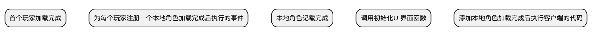

> ClientMain: 

> [!tip]*该客户端编程框架需要配合另外两个框架使用 ! ! !*  


> [!note|label:逻辑图]



<!--  --><!-- gif播放 -->
> [!note] *AvatarAdded()中的代码会在每个客户端加载完成的时候执行一次*
- 创建**ClientMain**客户端脚本:


```lua

local FunTable=RWrequire(CommonStorage["FunTable"]) -- 函数表

--————————————————————游戏初始化————————————————————--
local function AvatarAdded()
	local bool = true
	Players.PlayerAdded:Connect(function(Uid)
			if bool == true then -- 等待玩家加载完成
				bool = false
				local player=Players:GetPlayerByUserId(Uid)
				player.AvatarAdded:Connect(function(avatar)
						FunTable.InitTable.UI(Uid) --调用初始化UI界面函数
						
						-- 此处添加角色加载完成后执行客户端的代码
						
					end)
			end
		end)
end
AvatarAdded()
--————————————————————————————————————————ClientExpression————————————————————————————————————————--
-- 此处编写客户端表现

--————————————————————————————————————————ClientLogic————————————————————————————————————————--
-- 此处编写客户端逻辑代码

```

> [!note|label:视图]

　　　　　　层级:   
　　　　　　  
  
  
　　　　　　示例:  	
　　　　　　