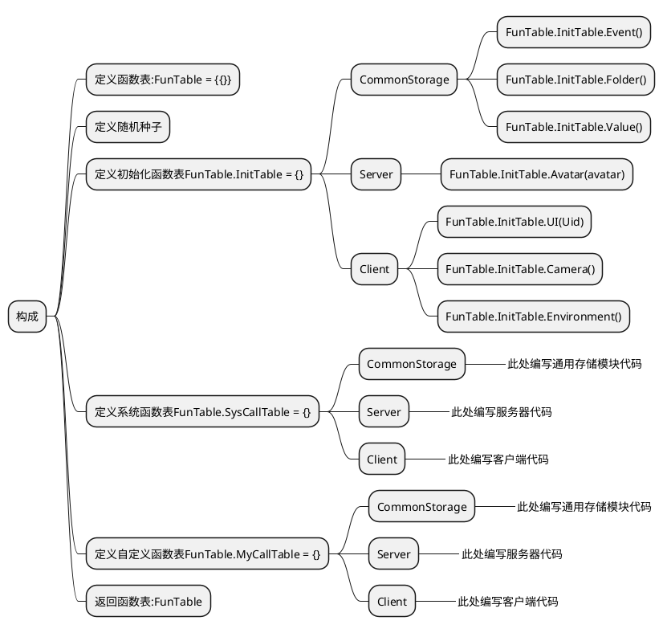

> FunTable:  

> [!tip]*该客户端编程框架需要配合另外两个框架使用 ! ! !* 


> [!note|label:逻辑图]


> [!note]*以下代码会在相应的服务器或者客户端调用后才执行*
 - 创建**FunTable**通用模块脚本:  


```lua

-- InitTable 初始化函数表 ; MyCallTable 用户自定义调用函数表 ; SysCallTable 系统定义调用函数表
local FunTable={ InitTable = {}, MyCallTable = {}, SysCallTable = {}} -- 函数表
-- 随机种子
math.randomseed(tostring(os.time()):reverse():sub(1, 7))
--——————————————————————————————————————InitTable = {}——————————————————————————————————————--
--——————————————————————————CommonStorage——————————————————————————--
--——————————初始化事件对象——————————--
function FunTable.InitTable.Event()
	if CommonStorage["EventFolder"].ServerFireClient == nil then
		--创建子集事件对象ServerFireClient
		local event1=RWObject:New("EventObject")
		event1.Name="ServerFireClient"
		event1.Parent=CommonStorage["EventFolder"]
		--创建子集事件对象ClientFireServer
		local event2=RWObject:New("EventObject")
		event2.Name="ClientFireServer"
		event2.Parent=CommonStorage["EventFolder"]
		--创建子集事件对象ServerFireServer
		local event3=RWObject:New("EventObject")
		event3.Name="ServerFireServer"
		event3.Parent=CommonStorage["EventFolder"]
		--创建子集事件对象ClientFireClient
		local event4=RWObject:New("EventObject")
		event4.Name="ClientFireClient"
		event4.Parent=CommonStorage["EventFolder"]
	end
end

--——————————通用存储层级文件初始化——————————--
function FunTable.InitTable.Folder()
	if CommonStorage.EventFolder == nil then
		--创建父级文件夹EventFolder
		local folder1=RWObject:New("Folder")
		folder1.Name="EventFolder"
		folder1.Parent=CommonStorage
		--创建父级文件夹ValueFolder
		local folder2=RWObject:New("Folder")
		folder2.Name="ValueFolder"
		folder2.Parent=CommonStorage
		--创建子集文件夹IntFolder
		local IntFolder=RWObject:New("Folder")
		IntFolder.Parent=CommonStorage["ValueFolder"]
		IntFolder.Name="IntFolder"
		--创建子集文件夹NumFolder
		local NumFolder=RWObject:New("Folder")
		NumFolder.Parent=CommonStorage["ValueFolder"]
		NumFolder.Name="NumFolder"
		--创建子集文件夹VectorFolder
		local VectorFolder=RWObject:New("Folder")
		VectorFolder.Parent=CommonStorage["ValueFolder"]
		VectorFolder.Name="VectorFolder"
		--创建子集文件夹ColorFolder
		local ColorFolder=RWObject:New("Folder")
		ColorFolder.Parent=CommonStorage["ValueFolder"]
		ColorFolder.Name="ColorFolder"
		--创建子集文件夹RayFolder
		local RayFolder=RWObject:New("Folder")
		RayFolder.Parent=CommonStorage["ValueFolder"]
		RayFolder.Name="RayFolder"
		--创建子集文件夹ObjFolder
		local ObjFolder=RWObject:New("Folder")
		ObjFolder.Parent=CommonStorage["ValueFolder"]
		ObjFolder.Name="ObjFolder"
		--创建父级文件夹MapFolder
		local folder3=RWObject:New("Folder")
		folder3.Name="MapFolder"
		folder3.Parent=ServerStorage
		--创建父级文件夹ShopFolder
		local folder4=RWObject:New("Folder")
		folder3.Name="ShopFolder"
		folder3.Parent=CommonStorage
	end
end

--——————————数值初始化——————————--
function FunTable.InitTable.Value()
	if CommonStorage["ValueFolder"]["NumFolder"].AvatarMoveSpeed == nil then
		--角色移动速度
		local AvatarMoveSpeed=RWObject:New("NumberValue")
		AvatarMoveSpeed.Name="AvatarMoveSpeed"
		AvatarMoveSpeed.Parent=CommonStorage["ValueFolder"]["NumFolder"]
		AvatarMoveSpeed.Value=4
		--角色跳跃初速度
		local AvatarJumpSpeed=RWObject:New("NumberValue")
		AvatarJumpSpeed.Name="AvatarJumpSpeed"
		AvatarJumpSpeed.Parent=CommonStorage["ValueFolder"]["NumFolder"]
		AvatarJumpSpeed.Value=12
		--角色信息显示距离
		local AvatarDisPlayDistance=RWObject:New("NumberValue")
		AvatarDisPlayDistance.Name="AvatarDisPlayDistance"
		AvatarDisPlayDistance.Parent=CommonStorage["ValueFolder"]["NumFolder"]
		AvatarDisPlayDistance.Value=15
		--摄像机距离
		local CameraDistance=RWObject:New("NumberValue")
		CameraDistance.Name="CameraDistance"
		CameraDistance.Parent=CommonStorage["ValueFolder"]["NumFolder"]
		CameraDistance.Value=2.5
		--摄像机距离上限
		local CameraMaxZoomDistance=RWObject:New("NumberValue")
		CameraMaxZoomDistance.Name="CameraMaxZoomDistance"
		CameraMaxZoomDistance.Parent=CommonStorage["ValueFolder"]["NumFolder"]
		CameraMaxZoomDistance.Value=5
		--摄像机距离下限
		local CameraMinZoomDistance=RWObject:New("NumberValue")
		CameraMinZoomDistance.Name="CameraMinZoomDistance"
		CameraMinZoomDistance.Parent=CommonStorage["ValueFolder"]["NumFolder"]
		CameraMinZoomDistance.Value=0
		--摄像机远景视野范围
		local CameraFarClipPlane=RWObject:New("NumberValue")
		CameraFarClipPlane.Name="CameraFarClipPlane"
		CameraFarClipPlane.Parent=CommonStorage["ValueFolder"]["NumFolder"]
		CameraFarClipPlane.Value=256
		--环境日光颜色
		local EnvironmentLightColor=RWObject:New("Vector3Value")
		EnvironmentLightColor.Name="EnvironmentLightColor"
		EnvironmentLightColor.Parent=CommonStorage["ValueFolder"]["VectorFolder"]
		EnvironmentLightColor.Value=Vector3(250,250,230)
		--环境日光方向
		local EnvironmentWorldRotation=RWObject:New("Vector3Value")
		EnvironmentWorldRotation.Name="EnvironmentWorldRotation"
		EnvironmentWorldRotation.Parent=CommonStorage["ValueFolder"]["VectorFolder"]
		EnvironmentWorldRotation.Value=Vector3(0,0,0)
	end
end
--——————————————————————————CommonStorage——————————————————————————--

--——————————————————————————Server——————————————————————————--
--——————————角色数据初始化——————————--
function FunTable.InitTable.Avatar(avatar)
	--移动速度初始化
	avatar.MoveSpeed=CommonStorage["ValueFolder"]["NumFolder"]["AvatarMoveSpeed"].Value
	--跳跃速度初始化
	avatar.JumpSpeed=CommonStorage["ValueFolder"]["NumFolder"]["AvatarJumpSpeed"].Value
	--信息显示距离初始化
	avatar.DisplayDistance=CommonStorage["ValueFolder"]["NumFolder"]["AvatarDisPlayDistance"].Value
end
--——————————————————————————Server——————————————————————————--

--——————————————————————————Client——————————————————————————--
--——————————UI界面数据初始化——————————--
function FunTable.InitTable.UI(Uid)
	local player=Players:GetPlayerByUserId(Uid)
	if player["GameUI"].GamePrepareUI == nil then
		local GamePrepareUI=RWObject:New("UiPanel")
		GamePrepareUI.Name="GamePrepareUI"
		GamePrepareUI.Parent=player["GameUI"]
		GamePrepareUI.AnchorMin=Vector2(0.5,0.5)
		GamePrepareUI.AnchorMax=Vector2(0.5,0.5)
		GamePrepareUI.SizeDelta=Vector2(-8,-6)
		GamePrepareUI.ImageColorA=0
		GamePrepareUI.IgnoreRayCast=true
	end
end

--——————————摄像机数据初始化——————————--
function FunTable.InitTable.Camera()
	local Camera=GetService("WorkSpace").CurCamera --获取当前摄像机
	Camera.CameraType=Enum.CameraType.Follow --摄像机类型:默认跟随
	Camera.Subject=Players:GetLocalPlayer().Avatar --摄像机对象
	Camera.Distance=CommonStorage["ValueFolder"]["NumFolder"]["CameraDistance"].Value
	Camera.MaxZoomDistance=CommonStorage["ValueFolder"]["NumFolder"]["CameraMaxZoomDistance"].Value
	Camera.MinZoomDistance=CommonStorage["ValueFolder"]["NumFolder"]["CameraMinZoomDistance"].Value
	Camera.FarClipPlane=CommonStorage["ValueFolder"]["NumFolder"]["CameraFarClipPlane"].Value
end

--——————————环境数据初始化——————————--
function FunTable.InitTable.Environment()
	local Environment=WorkSpace["Environment"]
	Environment.LightColor=CommonStorage["ValueFolder"]["VectorFolder"]["EnvironmentLightColor"].Value
	Environment.WorldRotation=CommonStorage["ValueFolder"]["VectorFolder"]["EnvironmentLightColor"].Value
end
--——————————————————————————Client——————————————————————————--
--——————————————————————————————————————InitTable = {}——————————————————————————————————————--


--——————————————————————————————————————SysCallTable = {}——————————————————————————————————————--
--——————————————————————————CommonStorage——————————————————————————--
-- 此处编写通用存储模块代码

--——————————————————————————CommonStorage——————————————————————————--

--——————————————————————————Server——————————————————————————--
-- 此处编写服务器代码

--——————————————————————————Server——————————————————————————--

--——————————————————————————Client——————————————————————————--
-- 此处编写客户端代码

--——————————————————————————Client——————————————————————————--
--——————————————————————————————————————SysCallTable = {}——————————————————————————————————————--


--——————————————————————————————————————MyCallTable = {}——————————————————————————————————————--
--——————————————————————————CommonStorage——————————————————————————--
-- 此处添加你的通用模块代码

--——————————————————————————CommonStorage——————————————————————————--

--——————————————————————————Server——————————————————————————--
-- 此处添加你的服务器代码

--——————————————————————————Server——————————————————————————--

--——————————————————————————Client——————————————————————————--
-- 此处添加你的客户端代码

--——————————————————————————Client——————————————————————————--
--——————————————————————————————————————MyCallTable = {}——————————————————————————————————————--

return FunTable

```
 
 
> [!note|label:视图]
 
 　　　　　　层级:   
 　　　　　　  
   
   
 　　　　　　示例:  	
 　　　　　　*注: 此处代码已折叠*  
 　　　　　　