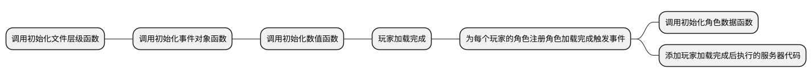

> ServerMain:  

> [!tip]*该客户端编程框架需要配合另外两个框架使用 ! ! !* 


> [!note|label:逻辑图]


> [!note]*PlayerAdded()中的代码会在玩家列表每次添加完成一个玩家时执行一次*
- 创建**ServerMain**客户端脚本: 


```lua

local FunTable=RWrequire(CommonStorage["FunTable"]) -- 函数表

--————————————————————游戏初始化————————————————————--
-- 初始化文件层级
FunTable.InitTable.Folder()

-- 初始化事件对象
FunTable.InitTable.Event()

-- 初始化数值
FunTable.InitTable.Value()

local function PlayerAdded()
	Players.PlayerAdded:Connect(function(Uid)
			local player=Players:GetPlayerByUserId(Uid)
			player.AvatarAdded:Connect(function(avatar) -- 为每个玩家的角色注册角色加载完成触发事件
					FunTable.InitTable.Avatar(avatar) -- 初始化角色数据
				end)

			-- 此处添加玩家加载完成后执行的服务器代码
			
		end)
end
PlayerAdded()
--————————————————————————————————————————ServerLogic————————————————————————————————————————--
-- 此处编写服务器逻辑代码

```

> [!note|label:视图]

　　　　　　层级:   
　　　　　　  
  
  
　　　　　　效果:  	
　　　　　　